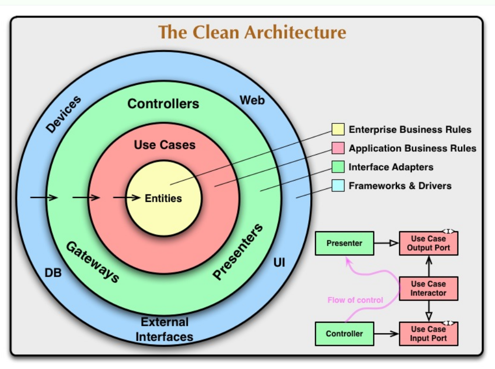
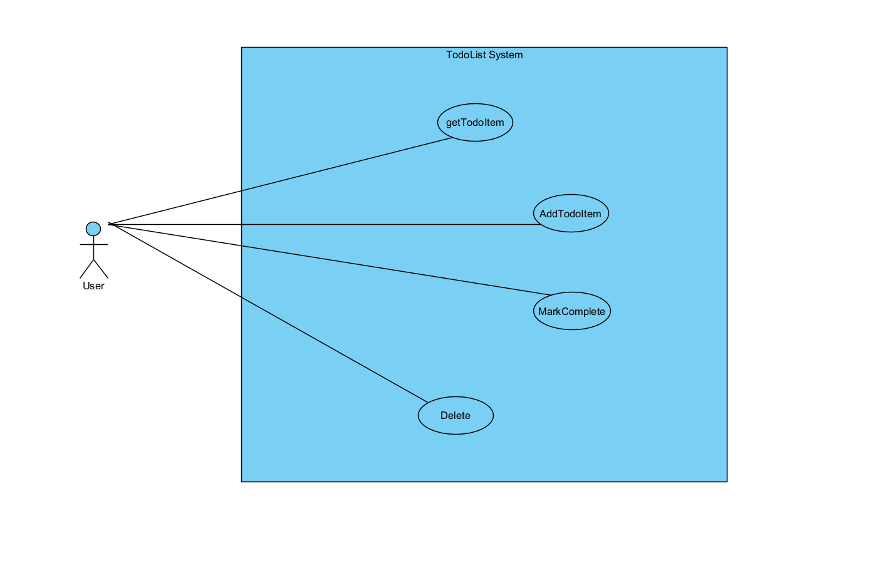
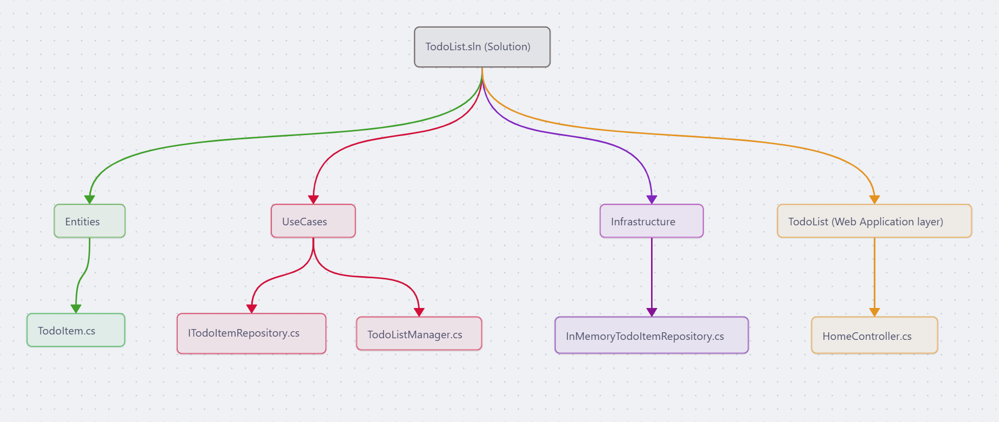
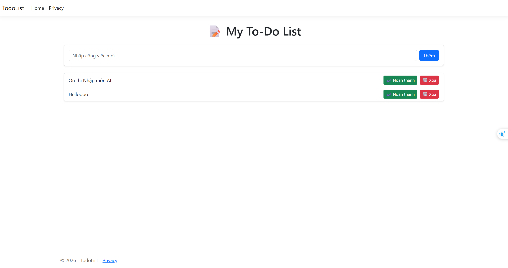

> Chào mọi người, vì mong muốn hiểu sâu hệ thống để bảo mật tốt hơn, nên mình học cách tìm hiểu người ta xây dựng nó bài bản như thế nào. Và đây là nhật ký `Part 1` của mình trong hành trình *tập làm thợ xây* với ASP.NET Core MVC.

# I. Các khái niệm
Đầu tiên ta sẽ cùng tìm hiểu về một số khái niệm cơ bản trong ASP.NET 

## 1. Interface là gì? 
- Interface là một contract mô tả các phương thức mà một class phải triển khai
- Ví dụ:

```C#
public interface IRepository
{
	string GetById(string id);
}
```

- Interface chỉ nói: 

> Muốn là IRepository thì phải có GetById()

- Nó không quan tâm code bên trong
- Class thực hiện:
```
public class MyRepository : IRepository
{
	public string GetById(string id)
	{
		return "ID: " + id;
	}
}
```
### Tại sao cần Interface??
- Để code phụ thuộc vào "chức năng" thay vì "class cụ thể"
- Ví dụ:

```
HomeController
	|
	v
IRepository
```

- Thay vì:

```
HomeController
	|
	v
MyRepository
```

- Sau này đổi `MyRepository` thành 1 tên khác thì Controller không phải sửa
---
## 2. Dependency Injection (DI) là gì?
- DI là kỹ thuật cung cấp các dependency từ bên ngoài thay vì tự tạo bên trong class
- Không dùng DI:

```C#
public HomeController()
{
	repository = new MyRepository();
}
```

- Dùng DI:

```C#
public HomeController(IRepository repository)
{
	this.repository = repository;
}
```

- Ở đây:

```
HomeController cần IRepository
```

nhưng không tự tạo mà ASP.NET sẽ đưa vào giúp
- **Lợi ích**:
	- Giảm phụ thuộc
	- Dễ thay thế implementation
	- Dễ test
---
## 3. Service Container hoạt động thế nào? 
- Service Container là nơi ASP.NET lưu các service đã đăng ký
- Bạn đăng ký:

```C#
builder.Services.AddTransient<IRepository>(services => new MyRepository());
```

- Container sẽ ghi nhớ:

```
IRepository
	|
	v
MyRepository
```

- Khi có class cần:

```C#
IRepository repository
```

- Container sẽ:

```
Tạo MyRepository
	|
	v
Đưa vào constructor
```
---
## 4. Constructor Injection là gì? 
- Là hình thức DI thông qua Constructor
- Ví dụ:

```C#
public HomeController(
	IRepository repository,
	ILogger<HomeController> logger)
{
	this.repository = repository,
	this.logger = logger;
}
```

- ASP.NET sẽ:

```
Tạo IRepository
Tạo ILogger

|
v
Truyền vào constructor
```

--> Gọi là `Constructor Injection` vì dependency được inject qua constructor

---
## 5. Service Lifetime là gì? 
- Là thời gian sống của object trong DI Container
### a. Transient

```C#
builder.Services.AddTransient<IRepository, MyRepository>();
```

- Với **Transient** - Mỗi lần Add như vậy cần tạo 1 object mới
- Ví dụ:

```
Request 1 --> Repository A
Request 2 --> Repository B
```

### b. Scoped 

```C#
builder.Services.AddScoped<IRepository, MyRepository>();
```

- Một request dùng chung một object

```
Request 1
|-Controller
|-Service
|-Repository

==> Cùng 1 object
```

- Request tiếp theo:
==> Object mới
- Đây là loại phổ biến nhất với Entity Framework
### c. Singleton 

```C#
builder.Services.AddSingleton<IRepository, MyRepository>();
```

- Toàn bộ ứng dụng:

```
1 object duy nhất
```

- Ví dụ:

```
Server Start
	|
	v
Repository A
	|
	v
Tất cả request dùng chung cho tới khi server tắt

```

## 6. Cấu trúc của 1 project ban đầu 
- Trong project MVC, ta để ý có các folder chính:

```
Controller/
Views/
Models/
wwwroot/
Program.cs
appsettings.json
```

- Hiểu đơn giản thì:

```
Controllers  -> nơi nhận request và điều hướng xử lý
Views        -> giao diện HTML/Razor
Models       -> class dữ liệu
wwwroot      -> CSS, JS, ảnh
Program.cs   -> cấu hình app, route, middleware
```

# II. Quy trình viết 1 Project 

## Giai đoạn 1: Phân tích và thiết kế (Non-code)
- Trước khi mở máy tính lên code, ta cần bắt đầu với việc tự hỏi: "**Hệ thống này sinh ra để làm gì và phục vụ ai??"
1. **Xác định Actor**: Actor ở đây có thể là User, Admin, Customer, Manager...

2. **Xác định Use-case**: User vào app để làm gì?
	- Xem danh sách công việc
	- Thêm công việc mới
	- Đánh dấu hoàn thành
	- Xóa công việc...

3. **Mô tả chi tiết Use-case để tìm ra Entity**: Từ việc mô tả các chức năng trên bằng lời, ta sẽ trích các **Danh từ** và **Động từ** trong câu ra để làm thành Entity và Method 
	- Danh từ sẽ trở thành **Entity - Thực thể dữ liệu**: `TodoItem` (gồm ID, Text nội dung, Trạng thái hoàn thành)
	- Động từ sẽ trở thành các **Hàm / Method**: `GetItems`, `AddItem`, `DeleteItem`, `SetStatus`

## Giai đoạn 2: Khởi tạo kiến trúc Clean Architecture 
- Dựa trên phân tích ở giai đoạn 1, ta chia hệ thống thành các lớp (Project) tách biệt hoàn toàn để dễ quản lý. 
- Mô hình **Clean Architecture**: Thay vì nhồi nhét tất cả vào 1 nơi, tác giả chia hệ thống thành các layers tách biệt hoàn toàn bằng cách tạo 1 Solution trống sau đó thêm từng project con đại diện cho từng lớp
	- **Lớp Entity (Thực thể)**: Tạo 1 class Library riêng để định nghĩa các đối tượng dữ liệu cốt lõi 
	- **Lớp Use Case (Nghiệp vụ)**: Tạo 1 class Library riêng định nghĩa các quy trình làm việc và giao diện (Interfaces) mà không phụ thuộc vào cơ sở dữ liệu hay giao diện người dùng 
	- **Lớp Infrastructure (Cơ sở hạ tầng)**: Tạo 1 class Library riêng để triển khai việc lưu trữ dữ liệu 
	- **Lớp Presentation (Giao diện web)**: Ứng dụng ASP.NET Core để làm giao diện web (UI) và kết nối các Project con ở trên lại với nhau 
- Các câu lệnh cần thiết để làm các thao tác mình nói ở trên:
```bash
- Tạo thư mục tổng và file Solution:
  dotnet new sln -n solution_filename
  
- Tạo các Project con (Các lớp - Layers):
  dotnet new classlib -n Entity #Lớp 1: chứa các thực thể cốt lõi (Domain/Entity)
  dotnet new classlib -n UseCase #Lớp 2: Chứa các quy trình nghiệp vụ và Interface (Use case)
  dotnet new classlib -n Infracstructure #Lớp 3: Chứa code truy xuất dữ liệu
  dotnet new mvc -n Website
  
- Đưa các Project con vào Solution:
  dotnet sln add Entity/Entity.csproj
  dotnet sln add UseCase/UseCase.csproj
  ...

- Thiết lập sự phụ thuộc (Project Reference) theo chuẩn Clean Architecture:
  Quy tắc cốt lõi: Lớp bên ngoài chỉ được gọi lớp bên trong, lớp bên trong không biết sự tồn tại của lớp bên ngoài
  # UseCase cần biết cấu trúc của Entity để xử lý logic
dotnet add UseCase/UseCase.csproj reference Entity/Entity.csproj

# Infrastructure cần biết cả UseCase (để triển khai Interface) và Entity (để lưu trữ)
dotnet add Infrastructure/Infrastructure.csproj reference UseCase/UseCase.csproj Entity/Entity.csproj

# Web là lớp ngoài cùng, cần reference tới tất cả để ghép nối hệ thống
dotnet add ToDoListWeb/ToDoListWeb.csproj reference Entity/Entity.csproj UseCase/UseCase.csproj Infrastructure/Infrastructure.csproj
```

- Thứ tự các lớp theo chuẩn `Clean Architecture`:



## Giai đoạn 3: Trình tự viết Code (Từ trong ra ngoài)
- Sau khi có bộ khung thư mục, ta bắt đầu viết code theo trình tự từ phần lõi ra đến phần giao diện:
### Bước 1: Code lớp `Entity` (Lõi hệ thống)
- Tạo file class `.cs` bên trong project **Entity** 
- Định nghĩa các thuộc tính - lớp này hoàn toàn không chứa logic xử lý database
### Bước 2: Code lớp `UseCase` (Định nghĩa nghiệp vụ)
- Tạo các **Interface**, khai báo tên các hàm mà không viết nội dung hàm đó như nào 
- Ta làm vậy để giao diện Web có thể gọi hàm mà không cần quan tâm dữ liệu được lưu vào RAM, SQL Server hay MongoDB 
### Bước 3: Code lớp `Infrastructure` 
- Tạo các class kế thừa `Interface` mà ta đã khai báo ở phần `UseCase` trên
- Đây là nơi ta viết nội dung cho các hàm mà ta khai báo tại Interface. 
### Bước 4: Code giao diện MVC 
- **Dependency Injection**: Vào `Program.cs` đăng ký các phụ thuộc
- **Controller**: Vào `HomeController.cs`, gọi các nghiệp vụ để lấy danh sách công việc hoặc thêm việc mới
- **Views (HTML/Razor)**: Nhận dữ liệu từ Controller và hiển thị thẻ `<ul>`, `<li>` hoặc các form `<input>` để người dùng thao tác 

# III. Thực hành: TodoList 

> Ta sẽ thực hành các lý thuyết ở trên qua việc thử viết 1 app TodoList đơn giản

## 1. Phân tích bài toán: 

- Để làm 1 TodoList app, mình phải xác định rõ:
  - Ai dùng cái này?? - User
  - Họ muốn làm gì (Use Case)?? - Xem danh sách, thêm việc mới, đánh dấu hoàn thành
  - Thực thể (Entity) cốt lõi là gì? Bóc tách từ các yêu cầu trên, mình nhận ra lõi của hệ thống chỉ là 1 đối tượng `TodoItem`

- Sơ đồ Use-Case sẽ có dạng như sau:



## 2. Clean Architecture: Chia để trị 

- Một cái làm mình khá lạ lẫm khi bắt tay vào làm 1 project thật đó là thay vì gõ `dotnet new mvc` để tạo ra 1 đống file gộp chung giao diện, database và logic vào 1 chỗ thì mình phải chia ứng dụng thành 4 thành phần tách biệt:
  - `Entities`: Lõi trung tâm
  - `UseCases`: Luồng xử lý nghiệp vụ
  - `Infrastructure`: Lớp hạ tầng lưu trữ 
  - `Web`: Lớp giao diện hiển thị

- Quy định ở đây rất nghiêm ngặt: **Lớp bên ngoài gọi lớp bên trong. Entities ở trong không cần biết ai đang gọi nó**. 
  - Việc này giống **Isolation** trong security vậy, giới hạn tầm ảnh hưởng để khi 1 thành phần lỗi, các thành phần khác không bị lỗi theo

- Tổng quan các file của project:



## 3. Trình tự viết Code: Xây từ lõi xây ra 

- Quá trình tạo file và viết class đi theo chiều từ trong ra ngoài

- **Bước 1**: Tạo Entity
  - Mình viết class `TodoItem.cs` bên trong lớp `Entities` chỉ chứa các thuộc tính mô tả dữ liệu, không hề có dòng code nào liên quan đến SQL hay giao diện

```C#
namespace Entities;

public class TodoItem 
{
    public string Id { get; set; } = Guid.NewGuid().ToString();
    public string Text { get; set; } = string.Empty;
    public bool IsComplete { get; set; }
}
```

- **Bước 2**: Định nghĩa Interface trong Use-Case 
  - Sang lớp `UseCases`, thay vì viết ngay code xử lý dữ liệu, mình tạo 1 file `ITodoItemRepository.cs`. Trong này chỉ liệt kê tên các hàm, nó đóng vai trò như 1 bản cam kết kiểu: "*Không cần biết dữ liệu được lấy và xử lý như nào, nhưng mà phải trả về cho Interface được nhưng thứ được định nghĩa trong đó*"

```C#
using Entities;

namespace UseCases;

public interface ITodoItemRepository
{
    void Add(TodoItem item);
    void Delete(int id);
    TodoItem GetById(int id);
    IEnumerable<TodoItem> GetItems(); 
    void Update(TodoItem item);
}
```

- **Bước 3**: Triển khai thực tế - `Infrastructue` 
  - Lúc này ở lớp `Infrastructure`, mình tạo 1 class để thực thi cái Interface bên trên. Để nhanh gọn thì mình dùng 1 list lưu thẳng vào RAM

- **Bước 4**: Ghép nối và hiển thị (Web MVC) 
  - Ở đây mình biết được 1 khái niệm `Dependency Injection`, mình cấu hình ở `Program.cs` để ứng dụng biết: "*Cứ khi nào Controller gọi ITodoItemRepository, hãy cấp cho nó cái InMemoryRepository*". Nhờ vậy, Controller làm việc cực kỳ nhàn rỗi.

```C#
// Bên trong HomeController.cs
public class HomeController : Controller
{
    private readonly ITodoItemRepository _repository;

    public HomeController(ITodoItemRepository repository)
    {
        _repository = repository; // Nhận công cụ từ hệ thống tiêm vào
    }

    public IActionResult Index()
    {
        var items = _repository.GetAll();
        return View(items); // Đẩy dữ liệu ra giao diện HTML
    }
}
```

# Tổng kết 

- Sản phẩm cuối cùng là 1 trang web To-do List cơ bản hiển thị thành công, mình đã nắm được tư duy luồng tổng quát: 

```
Phân tích -> Dựng kiến trúc -> Code Entity -> Interface configure -> Implement logic -> Đẩy ra giao diện
```




> Bài viết của mình đến đây là kết thúc, hẹn gặp lại ở Part 2 trong thời gian không xa =>>>