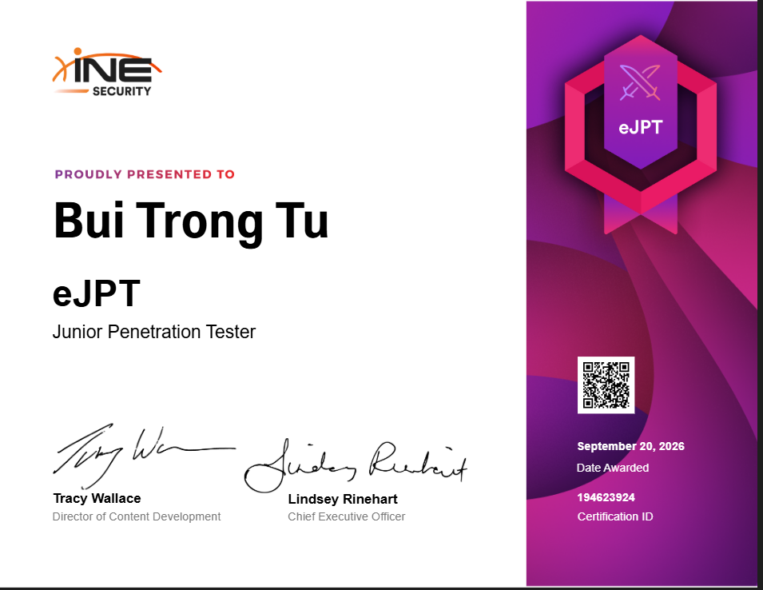
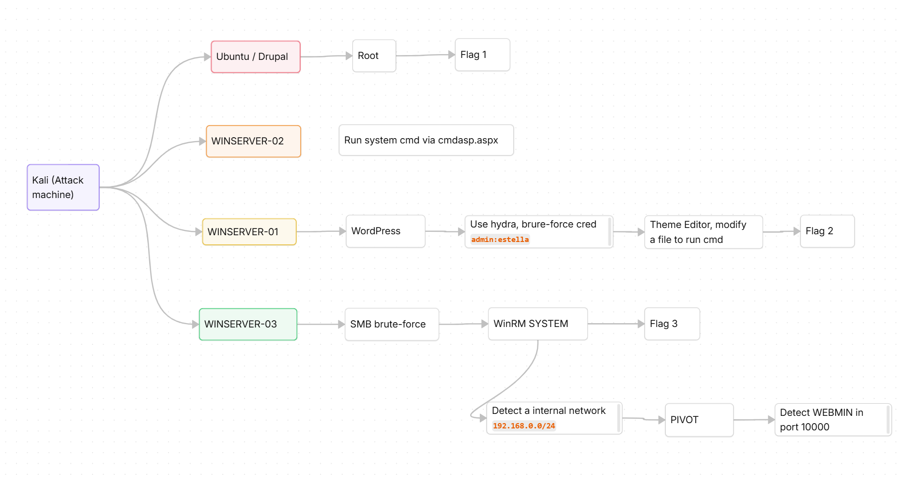

> Hi mọi người, cuối tuần trước mình quyết định thi lấy chứng chỉ đầu tiên để làm động lực cho các chứng chỉ tiếp theo, và mình chọn **eJPT** làm điểm đến đầu tiên (một phần cũng vì hôm trước nó đang sale :>>)

**Language / Ngôn ngữ:** [Tiếng Việt](#tiếng-việt) · [English](#english)

---

## Tiếng Việt

### Cách thức thi

- eJPT là bài thi thực hành bằng lab. Khi start exam, hệ thống cho một lab Unix trên browser (**không có VPN**) và trong box đó có kết nối tới các máy khác. Nhiệm vụ là xác định thông tin cũng như khai thác để trả lời các question đề yêu cầu — gồm **45 câu hỏi**.
  - **Thời gian thi:** 48h
  - **Số câu hỏi:** 45 câu (trong đó có 3 câu yêu cầu khai thác để lấy shell rồi đọc flag — flag là dynamic và chỉ được submit **1 lần duy nhất**)
  - **Điểm đạt:** 70%

### Các chủ đề và Domain kiến thức trong exam

eJPT xoay quanh bốn domain chính, với trọng số điểm khác nhau:

| Domain                              | Trọng số |
| ----------------------------------- | -------- |
| Host & Network Pentesting           | 35%      |
| Assessment Methodologies            | 25%      |
| Host & Networking Auditing          | 25%      |
| Web Application Penetration Testing | 15%      |

Theo trải nghiệm sau khi thi, các kỹ năng tối thiểu cần có:

- **Reconnaissance & Enumeration:** Quét host alive, quét port, nhận diện service và version
- **Web Application Testing:** Liệt kê thư mục/file ẩn, fingerprint CMS (WordPress, Drupal), khai thác lỗ hổng web
- **SMB & File Sharing:** Liệt kê share, kiểm tra null session, thu thập thông tin nhạy cảm
- **Exploitation:** Dùng Metasploit và các công cụ thủ công để khai thác dịch vụ
- **Privilege Escalation:** Leo thang đặc quyền trên cả Windows và Linux
- **Pivoting:** Dùng host dual-homed để pivot vào mạng nội bộ qua proxychains hoặc autoroute của Metasploit

### Format bài thi

Theo trải nghiệm thực tế trong quá trình thi, cấu trúc bài thi như sau:

- **Mạng DMZ** tổng cộng gồm 7 máy:
  - 1 gateway
  - 4 máy Windows, trong đó có 3 máy khai thác chính (`WINSERVER-01`, `WINSERVER-02`, `WINSERVER-03`)
  - 2 máy Unix, tập trung 1 máy Ubuntu khai thác chính

Flow khai thác tổng thể:

#### Các câu hỏi thường gặp

Các question trong bài thi thường xoay quanh:

- Có bao nhiêu host alive trong DMZ?
- Version của service X trên host Y là bao nhiêu?
- Địa chỉ IP của host chạy service X là gì?
- Có bao nhiêu user-account có thể enumerate / available trên service nào đó?
- Password của user X là gì?
- Flag trong file … là gì?
- Module Metasploit nào dùng để exploit lỗ hổng trên host X?

### Kinh nghiệm làm bài

#### Enumeration thật kỹ!!

Trong cả quá trình làm, mình nhận ra rằng **80% thời gian nên dành cho enumeration**. Quét Nmap kỹ để không bỏ sót port và thu thập đủ thông tin là điều quan trọng để có đủ dữ kiện khai thác.

#### Đọc trước các câu hỏi một lần

Các câu hỏi khá liên kết với nhau — câu này có thể là đáp án hoặc gợi ý của câu kia. Nên bỏ khoảng 5 phút đọc qua toàn bộ câu hỏi để đỡ tốn thời gian về sau.

#### Pivoting

Kỹ năng pivot khá quan trọng để hoàn thành exam tốt. Nếu chưa thành thạo pivot (tối thiểu biết `SOCKS tunneling` hoặc `meterpreter tunneling`), bạn có thể mắc kẹt ở DMZ và không trả lời được các question liên quan tới internal network.

#### Quản lý thời gian và nghỉ ngơi

Bài thi có hạn 48 giờ và không quá khó để hoàn thành — hoàn toàn có thể làm trong một buổi. Hãy giữ tâm thế chill, không cần quá áp lực về thời gian; ăn uống ngủ nghỉ rồi làm là được ^^

### Tài liệu ôn tập

Bạn có thể ôn tập và làm lab theo playlist này: [eJPT preparation](https://youtu.be/EOd_Qo_V5F4?si=i0gjw0v7CRAR_oNs)

---

## English

> Hi everyone — last weekend I decided to take my first cert as motivation for the ones that come next, and I chose **eJPT** as the starting point (partly because it was on sale :>>)

### Exam format

- eJPT is a **hands-on lab exam**. When you start, you get a Unix lab in the browser (**no VPN**). From that box you can reach other machines. Your job is to gather information and exploit systems to answer **45 questions**.
  - **Duration:** 48 hours
  - **Questions:** 45 (including 3 that require exploitation to get a shell and read a flag — flags are dynamic and can be submitted **only once**)
  - **Passing score:** 70%

### Domains covered in the exam

eJPT focuses on four main domains, weighted as follows:

| Domain                              | Weight |
| ----------------------------------- | ------ |
| Host & Network Pentesting           | 35%    |
| Assessment Methodologies            | 25%    |
| Host & Networking Auditing          | 25%    |
| Web Application Penetration Testing | 15%    |

From my experience after the exam, the minimum skills you need:

- **Reconnaissance & Enumeration:** Host discovery, port scanning, service/version identification
- **Web Application Testing:** Hidden directory/file discovery, CMS fingerprinting (WordPress, Drupal), exploiting web vulns
- **SMB & File Sharing:** Share enumeration, null sessions, collecting sensitive info
- **Exploitation:** Metasploit and manual exploitation of services
- **Privilege Escalation:** Escalating on both Windows and Linux
- **Pivoting:** Using dual-homed hosts to reach internal networks via proxychains or Metasploit autoroute

### Exam structure

From my actual exam run, the layout looked like this:

- **DMZ network** with 7 machines total:
  - 1 gateway
  - 4 Windows hosts, including 3 primary targets (`WINSERVER-01`, `WINSERVER-02`, `WINSERVER-03`)
  - 2 Unix hosts, with one Ubuntu box as a main target

Overall exploitation flow:

#### Common question types

Questions typically ask things like:

- How many hosts are alive in the DMZ?
- What is the version of service X on host Y?
- What is the IP of the host running service X?
- How many user accounts can you enumerate / are available on a given service?
- What is the password for user X?
- What is the flag in file …?
- Which Metasploit module exploits the vulnerability on host X?

### Tips from my attempt

#### Enumerate thoroughly!!

Throughout the exam I realized that **~80% of your time should go to enumeration**. Careful Nmap scanning so you don't miss ports — and collecting enough details — is what gives you the evidence you need to exploit.

#### Skim all questions first

The questions are fairly interconnected — one answer can unlock or hint at another. Spend about 5 minutes reading through everything first; it saves time later.

#### Pivoting

Pivoting matters a lot if you want a strong finish. If you're weak on pivot techniques (at least `SOCKS tunneling` or `meterpreter tunneling`), you can get stuck in the DMZ and miss internal-network questions.

#### Time management and rest

You have 48 hours, and the exam isn't that hard to finish — many people can complete it in a single session. Stay chill, don't overstress the clock; eat, sleep, then keep going ^^

### Study resources

You can study and practice labs with this playlist: [eJPT preparation](https://youtu.be/EOd_Qo_V5F4?si=i0gjw0v7CRAR_oNs)
